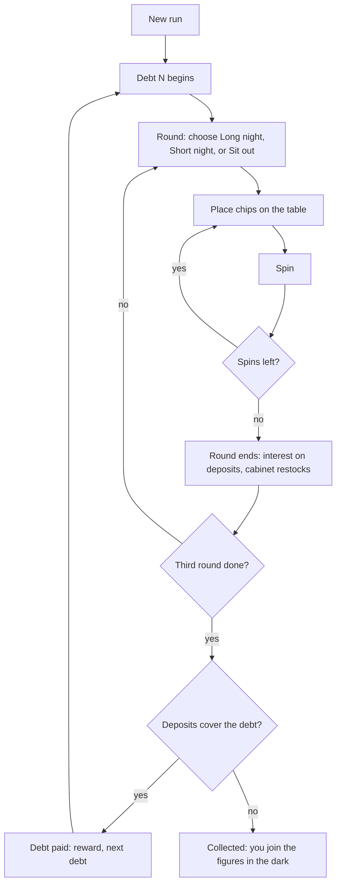

# Rien Ne Va Plus: Game Design Plan

*Rien ne va plus* is the croupier's call when betting closes: "no more bets".
Decisions made so far are listed under [Decisions](#12-decisions).

Status: plan only. The spinnable wheel scene exists; nothing below is built yet.
Every number here is a first draft meant to be tuned with the balance simulator
described in [9.8](#98-testing-and-the-balance-simulator).

**Contents**

1. [What we take from Clover Pit](#1-what-we-take-from-clover-pit)
2. [Pillars](#2-pillars)
3. [Premise and setting](#3-premise-and-setting)
4. [The run at a glance](#4-the-run-at-a-glance)
5. [Core systems](#5-core-systems)
6. [Content drafts](#6-content-drafts)
7. [Meta progression](#7-meta-progression)
8. [Presentation](#8-presentation)
9. [Technical plan](#9-technical-plan)
10. [Roadmap](#10-roadmap)
11. [Risks](#11-risks)
12. [Decisions](#12-decisions)

---

## 1. What we take from Clover Pit

### 1.1 Why its systems work

Reading the mechanics you sent, these are the design ideas that create the
feeling, separated from their slot-machine specifics.

| Clover Pit mechanic | What it does for the player | Our equivalent |
|---|---|---|
| Symbol **weights**, +0.8 per boost | Visible probabilities you can push, with built-in diminishing returns | Pocket **widths** on the wheel (5.4) |
| **Luck** forces symbols to match; thresholds guarantee wins | Luck is concrete and countable, not a vague % | **Nudge**: the ball hops toward your bets (5.6) |
| Spontaneous luck: generous **first deadline**, then a predictable schedule, plus **pity** after misses | The house "lets you win" early; experts learn to predict and plan around it | **The Lean**, telegraphed one spin early (5.6) |
| **666**, rolled last, ignores luck, capped | A risk you cannot build away; dread | **The Devil** (5.7) |
| Value × Multiplier × Pattern value × Pattern multiplier | Every upgrade is a ratio; decisions are about which factor is weakest | Chip value × Stake × Odds × Odds mult (5.5) |
| Rarity by reroll | Rare items feel rare without empty shops | Same idea, our own weights (5.8) |
| **Phone calls**, with **evil calls** triggered by hidden conditions | A mysterious other party; tempting deals with teeth | **Madame Zero's fortunes**, white and black cards (5.9) |
| **Memory cards** | Run-wide rule changes | **Records** on a gramophone (5.10) |
| **Traits** on charms | Same item, different roll; reasons to reroll | **Engravings** (6.4) |
| Fixed early debts, then super-exponential | Runs always end; numbers get absurd | Our own debt table (5.2) |
| Restock cost grows per buy, **resets each deadline** | Spending pressure renewed every deadline | Same shape, our numbers (5.8) |
| **Skip rounds** for tickets | Trade tempo for build | **Sit out** a round (5.2) |
| **Drawers** set the goal deadline | Each run pushes the finish line further | **Vault locks** (7.1) |

### 1.2 What the screenshots say about the feeling

- **One small place, everything within reach.** The cell holds the machine, the
  ATM, the store, the phone, the drawers. You turn your head between stations;
  you never walk anywhere.
- **The objects are the interface.** Prices sit on glass cases, the debt lives on
  the ATM, the 666 chance is written on a floppy disk, the lever is a lever.
  The only flat HUD is a few chunky counters in the corners.
- **Grime and one harsh light.** Mossy concrete, a caged bulb, prison bars,
  coins on the floor. Low-resolution textures and a crunchy, PS1-like render.
- **Mystery in the margins.** "DON'T TRUST..." scrawled on the wall, a red phone,
  a rarity chart nailed up like a notice.
- **Short, loud spins.** Big popups ("+376"), highlighted winning symbols, the
  "SPINS LEFT" counter ticking down.

### 1.3 What we deliberately leave behind

We keep the feeling and the structure, not the content: no slot symbols, no
phone, no ATM, no "Lucky Charms", no clover tickets, no drawers and box, and none
of Clover Pit's formulas or tables copied over. Roulette gives us mechanics
slots do not have, and the plan leans on them:

- **Two geometries.** Numbers sit next to different neighbours on the *wheel*
  (0-32-15-19...) and on the *table* (1-2-3 rows, 1-4-7 columns). Builds can
  play either map.
- **Every bet has the same base expected value.** A straight-up and a bet on red
  return the same on average and differ only in variance. Items break that
  symmetry, which makes every build a readable choice.
- **The ball travels.** It orbits, drops, bounces through pockets and settles.
  That path is where luck becomes visible.
- **Real casino vocabulary.** Voisins du Zéro, Tiers du Cylindre, Orphelins, the
  Snake bet, Finales, *rien ne va plus*. Free flavour that also works as content.
- **The numbers on a roulette wheel add up to 666** (0 + 1 + ... + 36). Our
  devil is already built into the wheel.

---

## 2. Pillars

1. **The light is the cell.** You never leave the pool of light around the giant
   wheel. Beyond it is darkness, and things stand in it.
2. **Everything is an object.** Debt, prices, odds and luck are shown on things
   in the room. The flat HUD is a handful of counters.
3. **Fast spins, loud payouts.** A spin takes 4–6 seconds, or about 2 in fast
   mode. Every win is a small show.
4. **Luck you can see and count.** Nudge, Leans and the Devil are announced and
   numeric. Players should be able to plan around them, and the best ones should
   be able to predict them.
5. **Build the wheel, not just the bets.** Your items, your chips *and the wheel
   itself* change over a run. A late-run wheel should look different from the
   one you started with.

---

## 3. Premise and setting

You wake standing at a small baize table at the rim of an enormous roulette
wheel, in a dark hall with a plank floor. A single bulb hangs over the wheel.
A brass teller's cage tells you what you owe and how many nights you have.
Somewhere in the dark, an automaton fortune teller, **Madame Zero**, runs the
House. She speaks through a horn: *"Faites vos jeux."*

Around the edge of the light stand still figures, facing the wheel. Each is
someone who could not pay. On your first run there is one. Every run you lose
adds another, and that one is you (7.3).

Colour carries meaning: **green belongs to the House.** The zero pocket, Madame
Zero's glowing eyes, cursed items and the Devil's chance indicator are the only
green things in the room. Everything else is mahogany, brass, ivory, oxblood
felt and the red and black of the numbers.

Light lore, delivered through scrawls on the floorboards and the backs of
fortune cards: "IT ALL ADDS UP TO 666", "ZERO IS NOT EMPTY", "DON'T TRUST THE
LEAN", "SHE WAS A PLAYER ONCE". The full story is left open for later; the
Vault ending (7.1) is where it pays off.

---

## 4. The run at a glance



- A **run** is a sequence of **debts**.
- Each debt has **3 rounds** ("nights").
- Each round you buy a number of **spins**, or sit the round out.
- Between spins, at any time: rearrange chips, buy and sell at the Curio Cabinet,
  deposit coins at the Cage, visit Madame Zero (once per debt), ring the Bell.
- At the end of the third round the Cage collects. Short of the debt, the run ends.

---

## 5. Core systems

### 5.1 Money

| Currency | Earned from | Spent on |
|---|---|---|
| **Coins** | Winning chips, some items, debt rewards | Spins, Cabinet restocks, fortune rerolls, deposits |
| **Tokens** (brass casino tokens) | Short nights, sat-out rounds, debt rewards, some items | Talismans and oddities at the Curio Cabinet |

**The Cage.** Deposits are one-way: coins go in and count toward the debt. At the
end of every round, deposits earn **interest (base 5%)**. Coins in hand are what
you spend, and what the Devil takes (5.7). The core money decision is to bank
coins (safe, growing) or keep them in hand (restocks, rerolls, flexibility).

When a debt is paid, the debt amount is removed from the deposits and any surplus
stays in the Cage, still earning interest.

**Starting state:** 10 coins, 4 tokens, 3 clay chips of value 1, the European
wheel, 6 talisman hooks.

### 5.2 Debts, rounds and spins

At the start of each round, choose one:

| Choice | Spins | Cost | Bonus |
|---|---|---|---|
| **Long night** | 7 | 7 × spin cost | none |
| **Short night** | 3 | 3 × spin cost | +1 token now |
| **Sit out** | 0 | none | +3 tokens when the debt is paid |

Debt table (first draft). Spin cost follows Fibonacci, a small detail players can
spot.

| Debt | Owed | Spin cost | Restock base |
|---|---|---|---|
| 1 | 60 | 1 | 2 |
| 2 | 180 | 2 | 5 |
| 3 | **666** | 3 | 15 |
| 4 | 2,500 | 5 | 50 |
| 5 | 12,000 | 8 | 200 |
| 6 | 36,000 | 13 | 700 |
| 7 | 120,000 | 21 | 2,000 |
| 8 | 370,000 | 34 | 6,000 |
| 9 | 1,300,000 | 55 | 25,000 |
| 10+ | previous × 6 × 2^(N−10) | Fibonacci continues | owed ÷ 50 |

From debt 10 the growth factor itself doubles each debt (×6, ×12, ×24...), so
endless runs reach absurd numbers. That is why money uses a big-number type from
day one (9.5).

**Debt reward:** +1 token, +3 tokens per sat-out round, and coins equal to 3 spins
at the next debt's spin cost.

**First sanity check (debt 1):** three chips of value 1 return about
3 × 36/37 ≈ 2.9 coins per spin, against a spin cost of 1. Three long nights are
21 spins, about +40 net, plus Leans and interest. With 10 starting coins that
lands near 60 when nothing goes wrong, so a first talisman or a good Lean decides
it. That is the intended tension; the simulator will confirm it.

### 5.3 The table: chips and bets

Chips are **owned objects, not wagers.** You do not risk them. A chip placed on a
bet pays when the bet wins and does nothing when it loses. The coin cost of a spin
is the risk, as with Clover Pit's spin cost.

- Start with 3 chips. Gain more from the Cabinet, fortunes and items.
- Chips stay where you left them between spins ("let it ride"). Rearranging is free.
- Several chips can stack on one bet; each pays separately.

**Odds** are the total return per unit of chip value, i.e. 36 ÷ numbers covered
(rounded down for sector bets, which keeps a slight house edge).

| Bet | Covers | Base odds | Notes |
|---|---|---|---|
| Straight up | 1 | 36 | |
| Split | 2 | 18 | adjacent on the table |
| Street | 3 | 12 | a row |
| Corner | 4 | 9 | |
| First Four | 4 | 9 | 0-1-2-3 |
| Six Line | 6 | 6 | two rows |
| Dozen | 12 | 3 | |
| Column | 12 | 3 | |
| Red / Black | 18 | 2 | by current pocket colour |
| Odd / Even | 18 | 2 | |
| High / Low | 18 | 2 | |
| *Neighbours* | 5 | 7 | number ± 2 on the wheel (unlockable) |
| *Finale* | 3–4 | 9–12 | numbers ending in a digit (unlockable) |
| *Jeu Zéro* | 7 | 5 | 12-35-3-26-0-32-15 (unlockable) |
| *Orphelins* | 8 | 4 | 1-20-14-31-9 and 17-34-6 (unlockable) |
| *Tiers du Cylindre* | 12 | 3 | the arc opposite zero (unlockable) |
| *Snake* | 12 | 3 | 1-5-9-12-14-16-19-23-27-30-32-34 (unlockable) |
| *Voisins du Zéro* | 17 | 2 | the arc around zero (unlockable) |

**Zero** loses every bet except bets that include it. It is the natural, frequent
"house wins" moment, and items can turn it around (Saint's Medal, House Key).

**Bet levels.** Some fortunes and oddities level up a bet type. Each level adds the
base odds again (Straight up: 36 → 72 → 108). This is the slow, permanent scaling
axis, the counterpart of upgrading pattern values.

### 5.4 The wheel: pockets you can build

The wheel is the deck. Each pocket has:

- a **number** (0–36),
- a **colour** (red, black, green),
- a **width** (base 1.0). The chance of landing in a pocket is its width over the
  total width. **The wheel is drawn from the widths**, so a widened pocket is
  physically wider on screen. Probability is something you can see.
- an optional **enhancement** (6.5).

Wheel-building actions, from items, fortunes and oddities:

| Action | Effect |
|---|---|
| Widen | +0.5 width. Diminishing returns come for free, because each widen is a smaller share of a bigger total. |
| Narrow | −0.5 width (minimum 0.25) |
| Repaint | Change a pocket's colour. Red/Black bets follow the paint, and the felt layout recolours to match. |
| Duplicate | Insert a second pocket with the same number. The table shows "×2" on that number. |
| Remove | Delete a pocket (minimum 18 pockets) |
| Enhance | Gild, glass, bone... (6.5) |

Bets follow **number labels**: a straight-up on 17 covers every pocket labelled 17.

A stats board in the room (5.11) shows the live chance of every number, colour,
dozen and column, so a heavily built wheel stays readable.

### 5.5 Spin resolution

The outcome is decided **before** anything moves. The animation is then
choreographed to deliver that result (9.6). This keeps results deterministic,
testable and replayable, and it is the only way luck can be shown honestly.

Order of operations:

1. **Before the spin:** use any Bell actives; total up Nudge (talismans + Lean +
   pity); total up the Devil's chance.
2. **Land:** draw a pocket for each ball by width (RNG stream `wheel`).
3. **Nudge:** each ball may hop up to *N* pockets along the wheel toward the best
   payout (5.6).
4. **Devil:** roll the Devil's chance (stream `devil`). Nudge cannot help here. If
   it fires, skip to 5.7.
5. **Pay:** for each ball, for each chip whose bet covers the landed number, and
   for geometry effects such as Mirror Shard and Croupier's Rake, compute the
   payout. Talismans trigger left to right along the rail.
6. **After the spin:** update streaks (misses, repeats, hot dozens) and run
   after-spin hooks.
7. **Bank** the total into coins in hand.

**Payout of one winning chip:**

```
payout = chip value × Stake × odds × Odds mult × pocket mult × (each × talisman)
```

- **Stake** starts at 1. Bonuses add to it ("+1 Stake").
- **Odds** is the bet's base odds × its level.
- **Odds mult** starts at 1. Bonuses add to it ("+1 Odds").
- **Pocket mult** is the product of the landed pocket's enhancements.
- **× talismans** multiply one after another.

Two brass plaques on either side of the felt show **STAKE ×n** and **ODDS ×n**.
As in Clover Pit, the useful question is always which factor is weakest
relative to what an upgrade adds.

A **miss** is a spin that pays nothing at all. Misses feed pity (5.6).

### 5.6 Luck: Nudge and the Lean

**Nudge** is luck as a number of pocket hops. After the ball settles, it may creep
up to *N* pockets clockwise or anticlockwise along the wheel, to whichever
reachable pocket pays the most. Ties go to fewer hops, then clockwise. If it is
already on the best reachable pocket, it stays. Every hop shows a spark and a tick.

- With 18 Nudge on a 37-pocket wheel, every pocket is in reach, which guarantees
  the best possible result. This is our "jackpot threshold".
- This creates roulette's own placement skill: **spread straight-ups around the
  wheel**, not the table, so any Nudge has something to reach.
- Some items restrict direction or target (Compass, Lodestone) to create builds.

**The Lean** is spontaneous Nudge from the House.

- **Telegraphed one spin early.** The bulb hums brighter, the wheel creaks and a
  LEAN lamp lights on the results board *before* you bet. You can move chips onto
  riskier bets for that spin. Clover Pit's sparks arrive mid-spin; ours give you a
  betting decision.
- **Debt 1 (teaching):** Leans on spins 2, 5, 9, 14 and 20 of the debt, each +5
  Nudge, with the whole schedule shifted by 0 or 1 at random.
- **From debt 2:** each long night has one Lean on a random spin after the first;
  a short night gets one on a coin flip. Strength +3 to +5, and +3 more if it
  falls on the round's last spin. **From debt 5** the House grows stingy and Leans
  come only every other round. Because each Lean is announced a spin ahead,
  players learn to hold Bell charges and risky chips for it.
- **Pity:** after 3 misses in a row, +4 Nudge, then +2 more for each further
  miss until something pays. Pity shows a different, colder spark, so players do
  not confuse it with a Lean.

### 5.7 The Devil

The wheel's numbers sum to 666. After the second debt is paid, the House notices
you: a green "666" counter appears on the Cage and the Devil is live.

- **Chance:** 1.5% at debt 3, +0.5% per later debt, plus cursed engravings and
  pockets, minus items (Salt Cellar, Evil Eye). **Cap 25%.** The current chance is
  always shown on the counter.
- **Rolled after Nudge, and Nudge cannot touch it.**
- **When it fires:** the number under the ball burns away to "666", the bulb goes
  out, and **every coin in hand is lost**. Deposits are safe, which is why
  banking matters.
- **Aftermath:** if you have not visited Madame Zero yet this debt, she now deals
  black cards (5.9).
- Some cursed items feed on the Devil (Black Candle, Bone Dice), a niche path like
  Clover Pit's Depression charm.

The existing harmless bulb flicker stays as an omen that means nothing, so a real
blackout lands harder.

### 5.8 Talismans and the Curio Cabinet

**Talismans** are gambler's superstitions and curios: a rabbit's foot, an evil
eye, a pawn ticket. They hang on a brass **rail** above the table, on **6 hooks**
at the start. **Order matters**: they trigger left to right, which matters for
copy effects, retriggers and "first/last" effects. Sell for half price in tokens.

**The Curio Cabinet** is a glass-front cabinet with 4 lit compartments: 3 talismans
and 1 **oddity** (a chip, a piece of wheel work, a record or a bet level).

| Rarity | Price (tokens) | Relative weight |
|---|---|---|
| Common | 3 | 1.00 |
| Uncommon | 4 | 0.85 |
| Rare | 6 | 0.60 |
| Legendary | 9 | 0.30 |
| Cursed | from black cards only | none |

Rarity works by reroll, as in Clover Pit: pick a random item, then reroll it with
probability 1 − weight. Duplicates are not offered.

**Restocks:** free at the start of every round. A paid restock costs the debt's
restock base, +20% (rounded up) after each paid restock, resetting every debt.

**The Bell.** A brass service bell on the table triggers active talismans with
charges (Wheel of Fortune, Glass Eye, Piggy Bank). Ding.

### 5.9 Madame Zero: fortunes

A fortune-teller automaton in a glass booth at the edge of the light. **Once per
debt**, pull her lever and she dispenses **3 fortune cards**. Take one. Rerolling
costs coins: the debt number + the number of rerolls already made.

- **White cards:** ordinary fortunes (6.2). Some have a maximum number of picks.
- **Black cards:** cursed deals with real upside and real damage (6.2). Dealt when
  the Devil fired earlier in this debt before your first visit. The deal is fixed
  the moment you first pull the lever, so you can choose to visit before or after
  the risky spins.
- Card text is written as her voice ("The reds run warm tonight"). Each card back
  carries a line of lore.

### 5.10 Records

A gramophone holds **one record** (two after a vault unlock). A record changes
**the music and one global rule** for as long as it plays. You can swap
records freely, but only the one playing has any effect. Records are sold as
oddities, found in the Vault, and occasionally given by fortunes. This puts the
soundtrack inside the build. Drafts in 6.3.

### 5.11 Chips, oddities and the room's boards

- **Chip materials** (6.6) are the per-chip enhancement axis.
- **Oddities** (the 4th compartment): new chips, wheel work (gild 2 pockets, widen
  a number, repaint a pocket), bet levels, records.
- **Boards in the room:**
  - **Results board:** a mechanical flip board showing the last 12 numbers with
    colours, spins left and the LEAN lamp.
  - **Stats chalkboard:** the live chance of each number, colour, dozen and column.
  - **Payout placard:** current odds per bet type, with levels.

---

## 6. Content drafts

A first pool to build from. Names and numbers are drafts.

### 6.1 Talismans (40)

| Talisman | Rarity | Effect | Plays with |
|---|---|---|---|
| Rabbit's Foot | Common | +1 Nudge | luck |
| Lucky Penny | Common | Each losing chip refunds 1 coin | economy |
| Red Ribbon | Common | Chips on red bets +1 Stake | red |
| Black Cat | Common | Chips on black bets ×2. Every 13th spin, −3 Nudge. | black, risk |
| Horseshoe | Common | Straight-up odds +12 | inside bets |
| Pocket Watch | Common | First spin of each round +4 Nudge | timing |
| Salt Cellar | Common | Devil chance −0.5% | safety |
| Pawn Ticket | Common | Interest +2% | economy |
| Crumpled Receipt | Common | +1 token at the end of each round | tokens |
| Matchbook | Common | A winning chip gains +1 value for the rest of the round | scaling |
| Chalk Stub | Common | +3 coins whenever the ball lands on an odd number | flat income |
| Wishbone | Common | The first miss each round refunds its spin cost | safety |
| Evil Eye | Uncommon | Devil chance halved | safety |
| Mirror Shard | Uncommon | The pocket directly opposite also counts as hit, at ×0.5 | wheel geometry |
| Croupier's Rake | Uncommon | Straight-ups on the result's wheel neighbours pay at ×0.25 | wheel geometry |
| Abacus | Uncommon | Dozen and column chips +1 Odds for each earlier hit on that dozen or column this round | streaks |
| Hourglass | Uncommon | +1 spin per round | tempo |
| Saint's Medal | Uncommon | Zero counts as both red and black | zero |
| Ledger | Uncommon | When a number repeats within the debt, that spin pays ×2 | streaks |
| Brass Knuckles | Uncommon | Corner chips ×2 | inside bets |
| Thirteen Ball | Uncommon | Result 13: everything pays ×13, and Nudge never moves the ball off 13 | jackpot |
| Fortune Cookie | Uncommon | Each spin names a random number; straight-ups on it pay ×7 | variance |
| Compass | Uncommon | +4 Nudge, clockwise hops only | luck |
| Ivory Ball | Rare | Launch a second ball every spin | multi-ball |
| Lodestone | Rare | +3 Nudge, but Nudge only moves toward straight-up chips | luck |
| Gilder's Knife | Rare | Once per round, gild the pocket the ball lands on | wheel-building |
| Snakeskin | Rare | Unlocks the Snake bet; Snake chips +2 Stake | special bets |
| Croupier's Glove | Rare | Unlocks sector bets; sector chips ×1.5 | special bets |
| Wheel of Fortune | Rare | Bell, 2 charges per debt: re-roll the ball, bets kept | active |
| Glass Eye | Rare | Bell, 1 charge per debt: see the next result before you bet | active |
| Piggy Bank | Rare | Gains 1 coin of value each spin. Bell: smash it for twice its value. | economy |
| Table Map | Rare | Splits and corners also pay when the ball lands next to them on the table | table geometry |
| Golden Ball | Legendary | All payouts ×3; Devil chance +3% | risk |
| Ouroboros | Legendary | Same number as the previous spin: ×36 | jackpot |
| House Key | Legendary | When zero hits, every chip on the table wins | zero |
| Metronome | Legendary | Every 4th spin of a round is a Lean | timing |
| Twin Mirrors | Legendary | Copies the talisman to its right | combos |
| Loaded Wheel | Legendary | On purchase, widen all red pockets +0.5 | wheel-building |
| Bone Dice | Cursed | +4 Stake; Devil chance +2% | Devil |
| Black Candle | Cursed | Leans are twice as strong; no pity | Devil, timing |

**Build families this pool supports:** colour stacking, straight-up hunting with
Nudge, wheel-geometry neighbours, table-geometry inside bets, streaks and repeats,
zero worship, multi-ball, economy and interest, Devil risk. Every family needs
at least one item at each rarity before content lock (Phase 7).

### 6.2 Fortunes

**White cards**

| Card | Effect | Rarity | Max picks |
|---|---|---|---|
| "A stranger tips well." | +5 tokens | Common | none |
| "Your stack grows heavy." | All chips +1 value | Common | none |
| "The bell rings twice." | Recharge all Bell talismans | Common | none |
| "The cabinet owes you." | Talismans cost 2 fewer tokens until the next restock | Common | none |
| "The reds run warm tonight." | Widen every red pocket +0.25 | Common | none |
| "The blacks run cold and deep." | Widen every black pocket +0.25 | Common | none |
| "Outside bets are safe bets." | Dozen, column and even-money bets +1 level | Uncommon | none |
| "Fortune favours the bold." | Straight-up +1 level | Uncommon | none |
| "Another hook on the wall." | +1 talisman hook | Uncommon | 1 |
| "A new chip in your pocket." | Gain a chip of a random material | Uncommon | none |
| "Gold finds gold." | Gild 3 random pockets | Rare | none |
| "Something carved in brass." | A random engraving on a random talisman | Rare | none |
| "Neighbours talk." | Unlock the Neighbours bet this run | Rare | 1 |

**Black cards**

| Card | Effect | Rarity |
|---|---|---|
| "Burn the ledger." | Double your tokens; coins in hand → 0 | Common |
| "Give it all back." | Double coins in hand; tokens → 0 | Common |
| "Bargain at the cabinet." | Two Cabinet items become free; tokens → 0 | Common |
| "Feed the zero." | Add a second zero pocket; all payouts ×2 for the rest of the run | Uncommon |
| "Shiny things." | Engrave every Cabinet item; one of your talismans gets the Cursed engraving | Rare |
| "Ask the figures." | The oldest figure in the dark disappears; +1 Nudge for the rest of the run | Rare |

### 6.3 Records

| Record | Rule while it plays |
|---|---|
| Waltz in Green | +1 Nudge every spin; spin cost ×1.5 |
| Red Light Tango | Red payouts ×2; black payouts ×0.5 |
| Lullaby for Zero | No Devil; no Leans |
| Overture of Excess | Debts ×2; all payouts ×3 |
| Funeral March | +2 tokens per round; payouts ×0.75 |
| Boogie-Woogie | Each win adds +1 Stake until the next miss |
| Nocturne | The last spin of each round pays ×4 |
| Static | No music; +1 talisman hook |
| Carousel | The wheel turns backwards; Nudge reaches 1 pocket further |
| Danse Macabre | +1% interest for each figure standing in the dark |

### 6.4 Engravings

Random modifiers on talismans. Possible from the second debt, or once a vault lock
is open.

| Engraving | Effect | Chance on a Cabinet talisman |
|---|---|---|
| Gilt | +2 tokens when a debt is paid | 2% |
| Keen | +1 Stake | 1.5% |
| Sharp | +1 Odds | 1% |
| Echo | The last payout of each spin triggers again | 1% |
| Restless | One free restock each debt | 2% |
| Thrifty | Interest +3% | 1.5% |
| Cursed | Devil chance +0.6% (only once the Devil is live) | 1.5% |

### 6.5 Pocket enhancements

| Enhancement | When the ball lands here |
|---|---|
| Gilded | Payouts ×2. Gilding again makes it platinum (×3). |
| Lucky | +2 Nudge on the next spin |
| Glass | Payouts ×4; 1 in 4 chance the pocket shatters into a Blank |
| Bone | +1 token |
| Ember | Chips that won here gain +1 value permanently |
| Cursed | Devil chance +1% for the rest of the round |
| Blank | No number. Nothing wins. (Created by shattering and some curses.) |

### 6.6 Chip materials

| Material | Effect |
|---|---|
| Clay | Base chip |
| Bone | +1 token whenever it wins |
| Glass | ×3 payout; 1 in 6 chance to break when it wins |
| Gold | +1 value each time it loses |
| Lead | Inside bets also pay ×0.33 when the ball lands on a wheel neighbour |
| Wax | ×2 payout; loses 1 value every spin and melts at 0 |

---

## 7. Meta progression

### 7.1 The Vault

At the back of the hall stands a vault door with **four padlocks**. Lock *k*
opens the first time you pay debt 3 + *k* with locks 1 to *k*−1 already open.

- **The goal moves.** A run's goal is debt 4 + (locks opened). Reaching the goal,
  the Cage asks whether you want to leave. **Step out of the light** to win and end
  the run, or keep playing for score. Leaving adds no figure.
- **Each lock adds to the pools:** new talismans, a sector-bet family, a record,
  a second gramophone slot, new starting wheels.
- **All four locks open:** the Vault opens after debt 8 or later, under conditions
  to design, and the ending plays. Endless mode unlocks afterwards.

### 7.2 Starting wheels and House Edge

- **Starting wheels**, unlocked through the Vault: European (default); American
  (adds 00, +2 tokens per round); Gilded (6 gilded pockets, debts ×1.5); Bone (all
  black pockets are bone, Devil live from debt 1); Mirror (reversed wheel order).
- **House Edge levels**, unlocked by winning, stack: +1 zero pocket; Devil from
  debt 2; −1 token per round; debts ×1.25; Leans weaker...

### 7.3 The figures in the dark

Every lost run leaves its figure standing at the edge of the light, facing the
wheel. Hovering over one shows its run: the debt reached, best spin, final build
and cause ("Collected at debt 4", "Taken by the Devil"). Older figures fade
further into the dark. They are the run history, the lore and the mood at once,
and some content refers to them (Danse Macabre, "Ask the figures").

### 7.4 The Almanac

A leather book on the table: discovered talismans, fortunes, records and
enhancements, plus stats. Undiscovered entries are silhouettes. Achievement
unlocks go here, for example "Hit the same number three times in one round"
unlocks Ouroboros.

---

## 8. Presentation

### 8.1 The room

The current scene becomes the hall. Stations sit at the edge of the light pool,
each with its own small light source:

| Station | Object | Purpose |
|---|---|---|
| The Table | baize lectern at the wheel's front-left rim, where the figure stands now | chips, Bell, STAKE/ODDS plaques, talisman rail above |
| The Wheel | the giant wheel under the bulb (built) | spins |
| The Cage | brass teller's cage with mechanical counters | deposit coins; OWED / DEPOSITED / NIGHTS LEFT / 666 counter |
| Curio Cabinet | glass cabinet, 4 lit compartments, restock crank, rarity chart nailed beside it | shop |
| Madame Zero | fortune-teller automaton in a glass booth, green eyes | fortunes |
| Gramophone | on a stool, record crate beneath | records |
| Boards | flip results board, stats chalkboard, payout placard | information |
| The Vault | iron door at the back, four padlocks, scrawls | meta progression |
| The figures | silhouettes at the edge of the light | run history |

### 8.2 Camera

- **Betting (first person at the table).** You look down at the felt with the
  giant wheel beyond it. Turn left and right between stations with A/D, the arrow
  keys or screen-edge clicks: fixed anchors with smooth eased moves, like turning
  your head in Clover Pit.
- **Spinning (third person, cinematic).** When the ball launches, the camera lifts
  out of your body to the current wide shot, and the figure at the table is you.
  It returns to the table for the payout.
- Reduced-motion mode skips the camera moves and cuts instead.

### 8.3 The spin, beat by beat

| Time | Beat |
|---|---|
| 0.0 s | Fling the wheel with the mouse (the current mechanic) or press Space. Madame Zero: *"Rien ne va plus."* Chips lock. |
| 0.0–0.4 s | Camera lifts to the wide shot. |
| 0.2–2.2 s | The ball orbits the track against the wheel's rotation, slowing; the rattle rises. |
| 2.2–3.0 s | The ball drops, bounces through 2–4 pockets. |
| 3.0–3.3 s | It settles. The number lights; the flip board clacks. |
| +0.12 s per hop | Nudge hops: spark and tick on each. |
| then | Camera returns. Winning chips glow, payouts pop per chip in rail order, triggering talismans shake and flash, and the total rolls into the coin counter. |

Normal spins take 4–6 seconds. Fast mode (hold Space) takes about 2 seconds and
skips the camera move. Fling strength is cosmetic only: it changes the number of
bounces, never the result.

### 8.4 HUD and diegetic UI

- **Flat HUD:** top-left coins in hand and spins left; top-right tokens; top-centre
  the last payout ("+376"); a small debt line ("OWED 666 · 2 NIGHTS"). Chunky
  type in boxes, as in Clover Pit's corners.
- **Everything else lives on objects:** prices on the Cabinet's tags, debt on the
  Cage, odds on the placard, probabilities on the chalkboard, the Devil's chance
  on the 666 counter, multipliers on the brass plaques.
- **Tooltips:** hover any object, talisman, chip or felt number for a card
  describing it.
- **Menus:** pause, settings, run summary, Almanac.

### 8.5 Art direction

- Keep what works: one bulb, deep blacks, procedural grime, grain, vignette.
- Add an **optional low-resolution "crunch" filter**: a lower internal render
  resolution, ordered dithering and a reduced palette, for Clover Pit's lo-fi
  texture. It can be the default or an option (see open decisions).
- Palette: black, bulb white, mahogany, brass, ivory, oxblood felt, number red and
  black, and green reserved for the House.

### 8.6 Audio

- Keep synthesised sound for now. Later, recorded or CC0 effects: the ball
  rattle (the most important sound in the game), chip clacks, coin cascades, the
  bell, flip-board clacks, the Cage's mechanical counters.
- Madame Zero's voice: short processed lines, always subtitled.
- Music comes from records only. With no record playing, there is room tone.
- Dynamic: the rattle's pitch follows ball speed, and a tension riser plays as the
  ball slows.

### 8.7 Accessibility

- A **flicker and blackout safety toggle**, because the bulb effects are
  photosensitivity risks.
- Colour-blind support: red pockets carry a diamond pip, black ones none, on the
  wheel and on the felt.
- Text size, subtitles, full keyboard play, reduced motion, hold or toggle for
  fast mode.

---

## 9. Technical plan

### 9.1 Architecture

Split the game into a **pure simulation core** and a **presentation layer**.

- `core/` has no DOM and no three.js. It takes actions ("place chip", "buy",
  "spin") and returns the new state plus an **ordered list of events** ("ball
  landed 17", "nudge hop to 34", "Red Ribbon +1 Stake", "chip paid 72").
- `view/` and `ui/` play those events back as animation and sound. Nothing in the
  view decides outcomes.

This keeps the rules testable in Node, lets the balance simulator run thousands of
games headless, and makes juice a matter of how events are played back.

### 9.2 Folder layout

```
src/
  core/
    rng.js          seeded streams
    num.js          big-number wrapper and formatting
    wheel.js        pocket model: numbers, colours, widths, enhancements
    bets.js         bet types, coverage, odds, levels
    resolve.js      one spin -> result + events
    nudge.js
    devil.js
    economy.js      debts, spin costs, interest, restock and reroll costs
    run.js          run state machine
    effects.js      hook dispatch
    save.js
    content/
      talismans.js  fortunes.js  records.js  engravings.js  enhancements.js  chips.js
  view/
    room.js         (current room.js)
    wheel/          wheel built from pocket data (refactor of current wheel.js)
    ball.js         choreographed ball
    stations/       table, cage, cabinet, oracle, gramophone, boards, vault, figures
    camera.js       anchors and transitions
    fx/             postfx (current), payout popups, sparks
  ui/               HUD, tooltips, menus
  audio/            current audio.js, then samples and records
  input/            actions mapped from mouse, keyboard, later gamepad (9.10)
  platform/         saves, achievements, window: web and Electron adapters (9.10)
sim/                headless balance simulator (Node)
desktop/            Electron shell and Steamworks glue (Phase 9)
tests/              vitest
```

### 9.3 Run state machine

```
RUN_START → DEBT_START → ROUND_START (choose package)
  → BETTING ⇄ (Cabinet, Cage, Madame Zero, Bell, Gramophone)
  → SPINNING → RESOLVED → (spins left ? BETTING : ROUND_END)
  → (round < 3 ? ROUND_START : COLLECTION)
  → (paid ? DEBT_START : GAME_OVER)       goal reached → LEAVE_OR_CONTINUE
```

### 9.4 Randomness

- One **run seed**, shown in the run summary so runs can be shared and replayed.
- **Separate streams** derived from it: `wheel`, `devil`, `lean`, `cabinet`,
  `fortunes`, `misc`. Restocking the Cabinet never changes your next spin.
- Save after each resolution so reloading cannot re-roll a spin.

### 9.5 Big numbers

Debts pass 10^300 in endless play, beyond JavaScript's number range. Use
**break_infinity.js** (a Decimal type built for incremental games) behind a small
`num.js` wrapper from the start, so we never have to retrofit it. Formatting:
`1,234` → `12.3K` → `4.56M` → `7.89e45`, with an option for scientific notation.

### 9.6 Ball choreography

1. Resolve the outcome first.
2. Animate the orbit with a fixed deceleration curve, and choose the drop moment.
3. Run the final phase (drop, bounces, settle) **in the rotor's frame**, so the
   target pocket is exactly under the ball when it stops, whatever the wheel is
   doing.
4. Nudge hops are extra pocket-to-pocket hops in the same frame.
5. Extra balls get their own staggered paths.

The wheel mesh is generated from pocket data (count, widths, colours, labels,
enhancements) and rebuilt when the wheel changes. The current fixed 37-slice
wheel becomes a special case.

### 9.7 Content as data

Each talisman, fortune, record, engraving, enhancement and chip material is a
data object with optional hooks:

```js
{
  id: 'red_ribbon',
  name: 'Red Ribbon',
  rarity: 'common',
  text: 'Chips on red bets +1 Stake.',
  hooks: {
    chipStake(ctx) { if (ctx.bet.kind === 'red') ctx.addStake(1); },
  },
}
```

Hook points: `runStart`, `debtStart`, `roundStart`, `beforeSpin` (Nudge, Devil
chance), `ballLanded`, `chipStake`, `chipOdds`, `chipPaid`, `afterSpin`,
`roundEnd` (interest, tokens), `debtPaid`, `purchased`, `sold`, `bell`. Every hook
that changes something emits an event, which is what makes the talisman shake on
screen.

### 9.8 Testing and the balance simulator

- **vitest** on the core:
  - Every base bet type returns 36/37 per unit of chip value over many spins (± a
    tolerance).
  - Spin resolution is deterministic per seed.
  - The payout formula matches hand-worked examples.
  - Save and load round-trip.
- **Balance simulator** (`npm run sim`): plays thousands of runs headless with a few
  bot strategies (outside bettor, straight-up hunter, greedy buyer) and reports the
  share of runs clearing each debt, median coins, and most-picked talismans.
  Draft targets for a sensible bot: debt 1 ≈ 95%, debt 2 ≈ 80%, debt 3 ≈ 60%,
  debt 4 ≈ 35%. Tune the debt table and spin costs against it.
- **Playwright smoke test** for the view, as already used for the wheel: load,
  place chips, spin, check for console errors.

### 9.9 Saving, performance and platform

- **Saves:** localStorage, versioned JSON with migrations. Meta progression (locks,
  figures, Almanac, stats) is stored separately from the current run.
- **Performance:**
  - Procedural textures currently take 1–2 s at load. Move generation to a Web
    Worker with OffscreenCanvas and cache the results.
  - Target 60 fps on integrated graphics, with a quality setting for shadows and
    render scale.
- **Platform:** see 9.10.

### 9.10 Steam

The game ships on Steam. It is developed and tested in the browser, then wrapped
as a desktop app. Building it in from the start costs little; retrofitting it
late is expensive.

- **Wrapper: Electron**, not Tauri. Tauri uses the system webview, which on Linux
  (including Steam Deck) is WebKitGTK, whose WebGL performance and consistency are
  poor. Electron ships its own Chromium, so the game renders the same everywhere.
- **Steamworks: steamworks.js** (a Node addon for Electron) for achievements, Steam
  Cloud and the overlay. The overlay needs its documented Electron workaround.
- **Platform adapter from Phase 1.** The core never touches storage or platform
  APIs directly. A small `platform/` layer provides save and load (localStorage
  on the web, files in the user-data folder on desktop, which Steam Auto-Cloud
  syncs), achievements (no-op on the web), and fullscreen and resolution.
- **Input actions from Phase 1.** Code against actions ("place chip", "spin",
  "turn left", "open tooltip"), not raw mouse events, so gamepad and Steam Input
  can be added without rewrites. Anything shown on hover must also be reachable
  by gamepad focus.
- **Steam Deck as a target device:** 1280×800, gamepad only, a 7-inch screen.
  Plan a Deck quality preset that holds a steady frame rate, and a minimum HUD
  and tooltip text size that stays legible there.
- **Achievements** map onto Almanac unlocks (7.4), so they are designed once.
- **Store side:** a Steam Direct fee per app, a store page with capsule art,
  screenshots and a trailer, and a release build pipeline. All of it comes after
  the game is fun (Phase 9).

---

## 10. Roadmap

Each phase ends with something playable. "Done when" is the bar for moving on.

| Phase | Builds | Done when |
|---|---|---|
| **0. Wheel** (done) | Room, wheel, mouse spin | ✓ |
| **1. Core loop** | `core/` with tests; felt layout and chips; choreographed ball to a decided pocket; payouts and popups; coins, spins, rounds, debts, the Cage; game over and restart; flat HUD | Debts 1–3 can be played start to finish with no items, and tests show base EV = 36/37 |
| **2. Builds** | Talismans (first 15) on the rail; Curio Cabinet with restocks; tokens; the Bell; tooltips | Two playthroughs with different talismans feel different |
| **3. Luck and risk** | Nudge and hops; telegraphed Leans; pity; the Devil; cursed items | You can plan around a Lean, and the Devil is feared |
| **4. The House** | Madame Zero with white and black cards; engravings; records and the gramophone | One fortune per debt changes a run's direction |
| **5. Building the wheel** | Wheel generated from pocket data; widen, repaint, duplicate, remove, enhancements; chip materials; oddities; stats board | A late wheel looks visibly different and the chalkboard explains it |
| **6. Meta** | Vault locks and moving goal; leave or continue; ending stub; figures in the dark; Almanac; saves; starting wheels; House Edge levels | A lost run leaves a figure; a won run unlocks something |
| **7. Content and balance** | 60+ talismans, 25 fortunes, 12 records; simulator tuning; endless mode with big numbers | Simulator curves hit their targets; each build family has an item at every rarity |
| **8. Polish** | Audio pass, first-debt teaching, settings and accessibility, performance, touch, optional crunch filter | A new player finishes debt 1 without reading anything outside the game |
| **9. Steam** | Electron build; steamworks.js (achievements, Cloud saves, overlay); full gamepad and Steam Input; Steam Deck preset and testing; store page and release pipeline | The game runs and saves through Steam on Windows and Steam Deck, playable start to finish on a gamepad |

### Phase 1 breakdown

1. Add vitest; write `core/rng.js`, `num.js` and `bets.js` with coverage tables
   for all base bets, tested against the real European layout.
2. `core/wheel.js` with the European pocket model; `core/resolve.js` with landing
   and payouts (no Nudge yet); an EV test.
3. `core/run.js` and `economy.js`: packages, spin costs, deposits, interest,
   collection, game over.
4. View: a felt layout on a lectern at the wheel's front-left rim, with clickable
   bet areas (inside bets on intersections and edges); chip drag and drop;
   highlighted covered numbers.
5. View: launch the ball from the turret and choreograph it into the decided
   pocket; results board.
6. Payout playback: chip glow, popups, coin counter; the Cage station with
   counters and a deposit interaction.
7. Camera anchors (table ↔ Cage) and the lift to the wide shot during spins.
8. Flat HUD, run-over screen, restart. A Playwright smoke test of a full debt.
9. From the first line: route input through `input/` actions and saves through
   `platform/`, even though only the web adapter exists yet (9.10).

---

## 11. Risks

| Risk | Mitigation |
|---|---|
| One number per spin is less spectacular than a 5×3 slot grid | Multi-ball, Nudge hops, per-chip payout cascades, talisman triggers, table glow |
| Spins feel slow | Hard 4–6 s budget, fast mode from Phase 1, no unskippable camera moves |
| Exponential numbers break balance | Simulator from Phase 1; big-number type from day one |
| Pocket widths and duplicates become unreadable | Stats chalkboard; hovering a felt number shows its chance; widths drawn to scale |
| Too many systems (chips, wheel, talismans, records, fortunes) | Introduce them across debts 1–3; the Vault gates content; each system ships only once the previous one is fun |
| Nudge toward the best pocket makes straight-ups dominant | Restricted-Nudge items, the Devil, payout curves; watch pick rates in the simulator |
| Procedural load time grows with more stations | Worker generation and caching (9.9) |

---

## 12. Decisions

| # | Question | Decision |
|---|---|---|
| 1 | Camera | **First person at the table, cutting to the third-person wide shot during spins.** (8.2) |
| 2 | What a chip is | **Owned bets, with a coin cost per spin.** (5.3) |
| 3 | Look | **Keep the current render, with an optional low-resolution crunch filter.** (8.5) |
| 4 | Leans | **Announced one spin early.** (5.6) |
| 5 | Name | **Rien Ne Va Plus.** |
| 6 | Platform | **Plan for Steam.** Developed in the browser, shipped as an Electron app. (9.10) |
